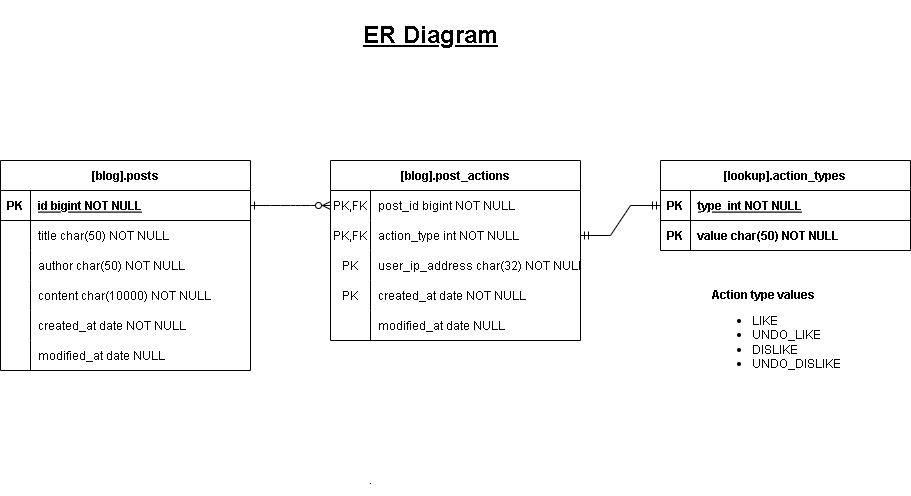

# The Application

A simple blog application built with React, PHP Laravel, and MySQL
Create, view and perform post interactions

This README contains instructions for setting up and running a web server using React, PHP Laravel, and MySQL. Follow
the steps below to configure and run each component of the application.

## Requirements

Make sure you have the following software installed:

- [PHP](https://www.php.net/manual/en/install.php)
- [MySQL](https://dev.mysql.com/downloads/installer/)
- [Node.js (version 14 or higher)](https://nodejs.org/en/download)
- Npm - comes with the Node.js installation

## Automatic setup and application start

### Windows

Run `Blogfull/start_app.bat` to install dependencies and start the application.

### Linux

Make the script executable by running `chmod +x start_app.sh` in the terminal.
Run the script by executing `./start_app.sh`
This should automatically install dependencies and start the application

#### _If you are having issues with the script or want to have your own configurations, follow the instructions below_

## Database

The following instructions need to be executed in the `Backend` directory.

### PHP support for MySql driver

Ensure `php.ini` has support for the MySQL driver by adding `extension=pdo_mysql` to your PHP interpreter's `php.ini`
file.

### Configure Database properties in `.env` file under `Backend/.env`

This is the default setup

```
DB_CONNECTION=mysql
DB_HOST=127.0.0.1
DB_PORT=3306
DB_DATABASE=bloggerDb
DB_USERNAME=root
DB_PASSWORD=password
```

### Create the database

Execute `php artisan db:create`

#### Create your tables:

Run the database migrations by executing `php artisan migrate`, this should give you the following tables:
`bloggerdb.posts`
`bloggerdb.post_actions` and
`bloggerdb.lookup_action_types`

#### Seed data into the database (optional):

Execute `php artisan seed`

## Frontend

The following instructions need to be executed in the `frontend` directory.

### Configure:

Configure the `.env` file to include the correct backend URL in `REACT_APP_BACKEND_BASE_URL`

### Install dependencies:

Execute `npm install` to install your application dependencies

### Start your application:

Execute `npm start` to serve your React application on `localhost:3000`

## Backend

### Configure:

Skim through the `.env` file and adjust your application and database configurations as needed
###Install application dependencies:

Execute `composer install --no-interaction --no-ansi --ignore-platform-reqs`

### Run the server

Execute`php artisan serve`, and the server should now be hosted at `localhost:8000`

### Generating API contracts, frontend models and Postman Collection

- Uncomment `extension=fileinfo` from `php.ini` to enable `finfo`
- Run `php artisan scribe:generate` to regenerate API docs
- Access the API docs page at `localhost:8000/docs`
- The Postman collection can be found in `public/docs/collection.json`

## Assets

- Useful SQL queries are available under `Assets/useful_SQL_queries.sql`
- Database diagram is included under `Assets/bloggerdb_database_diagram.drawio`
  
- Postman collection is included under `Backend/public/docs/collection.json` (see above for instructions on how to
  generate this)